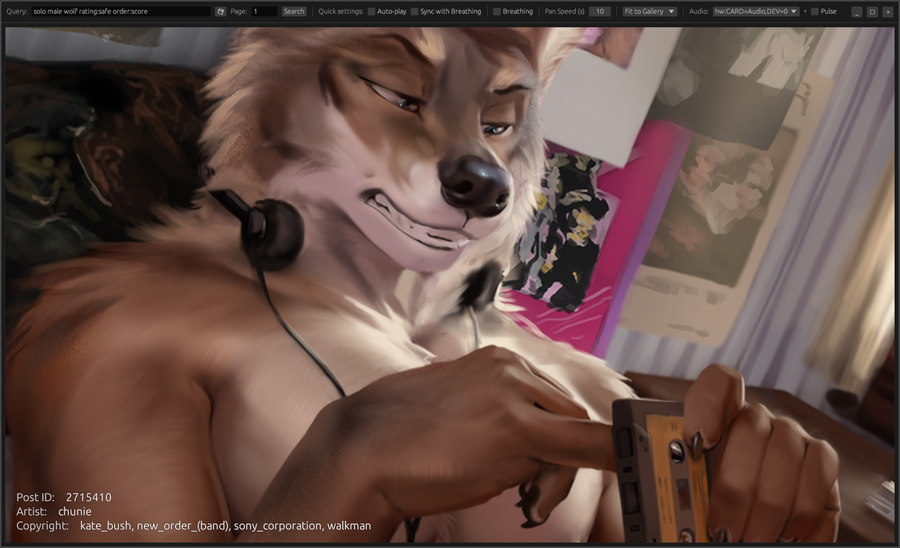

# Sodglumate
A native media browser for [e621](https://e621.net).

<kbd></img></kbd>

## About

> [!WARNING]  
> This application is intended for adult use only.

Sodglumate is a desktop application for browsing and viewing media from e621.

Designed with mostly single-handed operation in mind.

### Features
- Tag-based search with pagination
- Support for images (JPEG, PNG, WebP, GIF)
- Automatic slideshow with configurable timing
- Auto-panning for images larger than viewport
- Aggressive prefetching for seamless browsing
- Built-in "breathing timer" 😉\*

\* *The breathing timer is intended to be used at your own risk. Sodglumate is not a medical app.*

### Controls

The app is intended to be used with mostly single-handed operation in mind.
For this reason, most keystrokes are located on the left side of the keyboard.

| Keystroke | Effect |
|---|---|
| **Space** | Next Image |
| **Shift+Space** | Previous Image |
| **Ctrl+Space** | Skip 10 Images |
| **WASD** | Pan Image / Scroll |
| **C** | Toggle Auto-play |

Hold **Shift** to open the island, use **WASD** to select a tile, and press
**Space** to activate it. The **Links** submenu contains **Back**, **Parent**
when available, and **Child1**, **Child2**, etc., up to nine tiles total.
Child tiles appear only after their post data confirms a non-deleted post with
a media URL and a format supported by this build. Unavailable children are omitted.
Opening a parent or child replaces the current post in its existing result slot;
previous/next navigation still follows the surrounding search results. **Back**
returns to the root island menu.

### Links

This project makes use of e621's API. For more information, see the [e621.net API Documentation](https://e621.net/wiki_pages/help:api).

## Downloads

Pre-built binaries are available for download on the [Releases](https://github.com/abcight/sodglumate-rs/releases) page.

The newest binaries are as follows:
| Platform | Mirror |
|---|---|
| Windows x86_64 | [Download](https://github.com/Abcight/sodglumate-rs/releases/download/0.1.0/Sodglumate.0.1.0.Win64.x86_64.Bare.zip) |
| Linux x86_64 | [Download](https://github.com/Abcight/sodglumate-rs/releases/download/0.1.0/Sodglumate.0.1.0.Linux.x86_64.Bare.zip) |

## Issues & Feedback

Please report any issues or feedback on the [Issues](https://github.com/abcight/sodglumate-rs/issues) page.

Alternatively, you can also contact me on Discord at `abcight`. Note that I am not always online, and may not accept your friend request.

## Building from Source

### Pre-Requisites

* [Rust](https://www.rust-lang.org/tools/install) (2024 edition)

On Ubuntu/Debian, install system dependencies with:

```sh
make setup
```

### Building

```sh
make build
```

The result will be a `sodglumate-rs` binary found in `target/release`.

### Running

```sh
make run
```

### Search Syntax

The search bar accepts e621's tag syntax. Examples:

```
wolf solo order:score
~male ~female rating:safe
artist:husdingo -comic
```

See [e621 cheatsheet](https://e621.net/wiki_pages/help:cheatsheet) for full syntax.

## Contributing

See the repository-wide [contribution guidelines](../CONTRIBUTING). All
contributions require a signed-off commit under the repository DCO and CLA.

## License

This project is licensed under the GNU Affero General Public License v3.0 only.
See [LICENSE](LICENSE) for the full license text.
